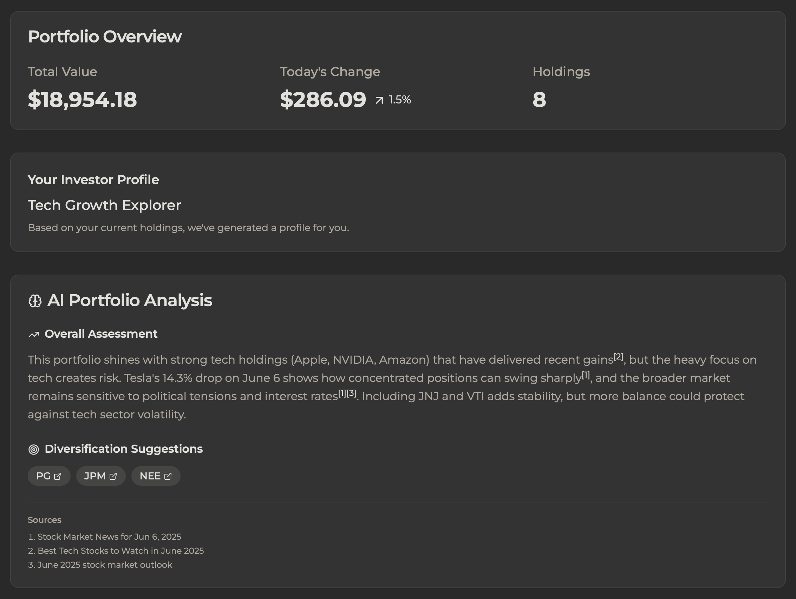
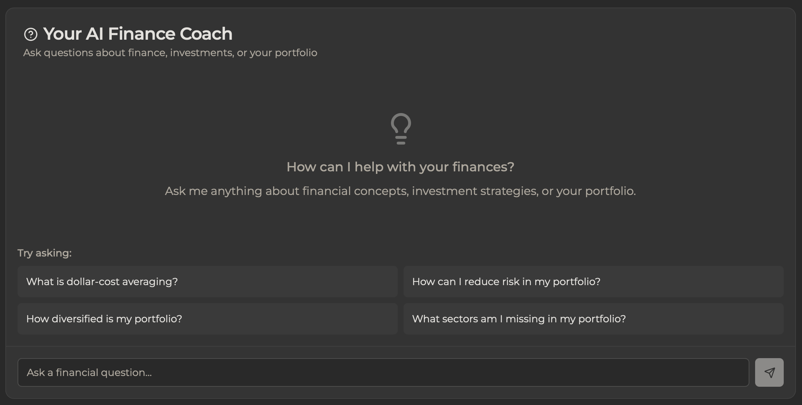
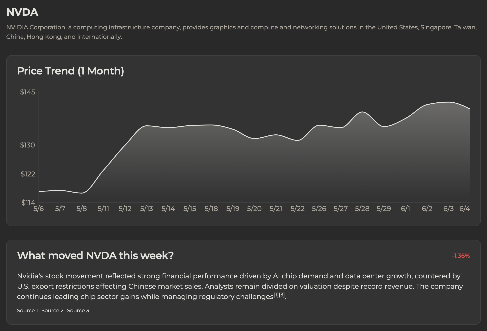

# 🚀 WalletWise

Your AI-powered finance coach for smarter portfolio investing. WalletWise helps new investors understand their portfolios, analyze individual stocks, and make informed investment decisions with AI insights backed by reliable sources. WalletWise combines portfolio insights, AI-powered guidance, and live market data, so you can dig into the nuances of your investments, ask questions, and learn as you go.


[▶️ Watch the video walkthrough](https://youtu.be/w6w0OWeG5rY?si=Mgxl7ziw-wtM3z7T)

## 🎯 What is WalletWise?

WalletWise is a comprehensive financial analysis platform that combines:
- **Portfolio Intelligence**: Upload your holdings for personalized analysis
- **AI Finance Coach**: Interactive Q&A for investment education  
- **Real-Time Market Data**: Live charts and company fundamentals
- **AI-Powered Insights**: Movement explanations, risk analysis, and recommendations
- **Accurate Citations**: AI analysis comes with inline superscript links to sources, no fake references

Perfect for new investors who want to understand their investments better and grow their financial knowledge.

## ✨ Key Features

### 📊 **Portfolio Analysis**
- **CSV Upload**: Simple ticker + shares format for instant portfolio analysis
- **Portfolio Overview**: Total value, daily changes, asset allocation visualization
- **Diversification Analysis**: AI recommendations for portfolio improvement
- **Investor Personality**: Understand your investment style and risk profile



### 🤖 **AI Finance Coach**
- **Interactive Q&A**: Ask anything about investing, your portfolio, or market concepts
- **Reliable Sources**: All AI responses include proper citations and source links
- **Personalized Guidance**: Context-aware responses based on your actual holdings
- **Educational Focus**: Learn while you analyze



### 📈 **Individual Stock Analysis**
- **Company Descriptions**: Understand what each company actually does
- **Real-Time Charts**: 30-day price history with interactive data points
- **Movement Explanations**: AI analysis of why stocks moved up or down
- **Risk Highlights**: Identify potential concerns with each holding
- **Similar Stocks**: Discover comparable investment opportunities



## 🛠️ Tech Stack

- **Frontend**: Next.js 14 with TypeScript and Tailwind CSS
- **Data Visualization**: Recharts for interactive charts
- **Financial Data**: Yahoo Finance library for real-time market data
- **AI Analysis**: Perplexity Sonar API for intelligent insights with citations
- **Fonts**: Montserrat for modern, professional typography
- **Icons**: Lucide React for consistent iconography

## 🚀 Getting Started

### Prerequisites
- Node.js v18 or higher
- npm v9 or higher

### Installation

1. **Clone the repository**
   ```bash
   git clone https://github.com/yourusername/walletwise.git
   cd walletwise
   ```

2. **Install dependencies**
   ```bash
   npm install
   ```

3. **Set up environment variables**
   ```bash
   cp .env.example .env.local
   ```
   Add your Perplexity API key to `.env.local`:
   ```
   SONAR_KEY=your_api_key_here
   ```

4. **Start the development server**
   ```bash
   npm run dev
   ```

5. **Open your browser**
   Navigate to `http://localhost:3000`

## 📋 Portfolio CSV Format

WalletWise uses a simple 2-column CSV format:

```csv
ticker,shares
AAPL,10
MSFT,25
GOOGL,5
TSLA,15
```

For a sample CSV portfolio, see [examples/sample-portfolio.csv](docs/example/Example_Portfolio.csv).

**Requirements:**
- `ticker`: Stock symbol (e.g., AAPL, MSFT)
- `shares`: Number of shares owned (whole or decimal numbers)

## 🎯 How to Use WalletWise

### For Portfolio Analysis:
1. **Upload CSV**: Drag and drop your portfolio file
2. **Get Insights**: View allocation, performance, and AI analysis
3. **Ask Questions**: Use the AI coach for personalized guidance
4. **Explore Holdings**: Click any stock for detailed individual analysis

### For Individual Stocks:
1. **Enter Ticker**: Type any stock symbol (AAPL, TSLA, etc.)
2. **View Analysis**: Company description, charts, fundamentals financial metrics
3. **Understand Movements**: AI explanations for price changes
4. **Assess Risks**: Review potential concerns and challenges

## 🔍 API Endpoints

- **Portfolio Analysis**: `/api/portfolio` - Basic portfolio data
- **Portfolio AI Analysis**: `/api/portfolio/ai-analysis` - AI insights and recommendations  
- **Stock Data**: `/api/ticker/[symbol]` - Real-time stock data and fundamentals
- **Stock AI Analysis**: `/api/ticker/[symbol]/ai-analysis` - AI movement and risk analysis
- **Q&A Coach**: `/api/qna` - Interactive finance coaching

## 🏗️ Architecture

**Two-Phase Loading System:**
- **Phase 1**: Fast loading of essential data (charts, fundamentals, portfolio overview)
- **Phase 2**: Background AI processing for insights, explanations, and recommendations

**Benefits:**
- Users see core data in 1-2 seconds
- AI analysis loads progressively
- Graceful fallbacks if AI services are slow

**🔮 Future Enhancements:**
- User authentication and saved portfolios
- Wealthsimple import integration
- Historical portfolio tracking
- Advanced charting options
- Social sharing features
- PWA mobile app

## 🤝 Contributing

1. Fork the repository
2. Create a feature branch (`git checkout -b feature/cool-feature`)
3. Commit your changes (`git commit -m 'Add cool feature'`)
4. Push to the branch (`git push origin feature/cool-feature`)
5. Open a Pull Request

## ⚠️ Disclaimer

WalletWise is an educational tool designed to help users understand investing concepts and analyze their portfolios. It is **not financial advice**. All AI-generated insights are for educational purposes only and should not be used as the sole basis for investment decisions. Always consult with qualified financial advisors before making investment choices.

## 📄 License

[](LICENSE) This project is licensed under the MIT License - see the [LICENSE](LICENSE) file for details.

---

**A tool I wish I had, built to help new investors understand their money better.**
